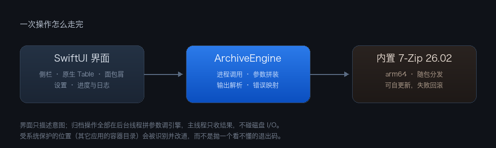

<div align="center">


<br>


</div>

---

## 这是什么

一个 **macOS 原生的 PeaZip 前端**。界面用 SwiftUI 从头写，压缩解压交给**随包分发的 7-Zip 26.02 引擎**，装好后就是 `/Applications/PeaZip.app`，直接替换掉原来的 Lazarus/LCL 版本。

不是套壳、不是脚本集合：文件浏览、压缩包内导航、包内增删、访达右键服务、设置窗口、引擎自更新都是原生控件实现，并且**自带引擎** —— 不依赖系统里装过什么压缩软件。

## 为什么要重写界面

原版有两个绕不过去的毛病：

| 问题 | 原因 |
|---|---|
| **整个界面发糊** | LCL 把每个主题图标强制标准化成 16px，在 2 倍视网膜屏上被放大 —— 素材多清楚都没用 |
| **界面不是 macOS 的样子** | 自绘控件、自绘标签页，跟 Big Sur 之后的设计语言无关 |

这个版本用原生控件 + 全矢量 SF Symbols 从根上解决，不跟位图打交道。

## 功能

| | 说明 |
|---|---|
| **压缩包内浏览** | 双击压缩包**进包看内容**（不再直接解压）；面包屑逐层进入，7z 的扁平列表被折叠成文件夹，大小按含子项聚合 |
| **包内直接增删** | 不解压就能往包里加文件、删文件。ZIP / 7Z / TAR 可写；**RAR 明确只读**并给出中文提示，而不是静默失败 |
| **拖拽** | 拖进窗口 = 加入当前包；包内条目拖到访达 = 解压出来 |
| **访达右键服务** | 压缩为 ZIP、压缩为 7Z、解压到新文件夹、测试压缩包完整性，共 4 项 |
| **受保护位置自动处理** | 微信 / QQ 等应用文件夹系统禁止写入 —— 自动改到 `~/Downloads` 并说明原因，而不是抛一个 `status=2` |
| **排除规则** | macOS 垃圾文件、隐藏文件（默认开）、Windows 冗余文件、自定义通配符 |
| **引擎自更新** | 从 PeaZip 官方发布版拉取并替换内置引擎，先验后用、失败回滚 |
| **完整中文界面** | 包括标准菜单栏在内，`CFBundleDevelopmentRegion` + `.lproj` 落地 |
| 其他 | 安全删除（多遍覆写）、格式转换、完整性测试、搜索、排序、隐藏文件开关 |

## 安装

需要 macOS 15+ 与 Swift 6 工具链。

```bash
git clone https://github.com/Yww1996/peazip-macos.git
cd peazip-macos
./package.sh     # 构建 release → 组装 build/PeaZip-dev.app → 签名 → 启动并验证窗口
./install.sh     # 安装到 /Applications/PeaZip.app（备份原版，不删除）
```

两个脚本都会先 `swift build`，并在打包后**比对 md5**。安装脚本还会自动核验：内置引擎可执行、指向的是内置副本而不是系统里别的 PeaZip、归档往返自测通过。

## 架构



界面只描述意图。所有归档操作都在后台线程拼参数调引擎，主线程只收结果 —— 视图体里**绝不做磁盘 I/O**，否则 `~/Desktop`、`~/Documents` 被 TCC 拦下会阻塞主线程，窗口永远不出现。

## 目录

```
Package.swift              构建配置（macOS 15+ 字符串版本，见下）
Sources/PeaZip27/
  PeaZip27App.swift        入口、菜单、Finder 服务、无头自检入口
  AppModel.swift           状态：浏览、面包屑、包内导航、服务处理
  ContentView.swift        界面：侧栏 + 原生 Table + 面包屑 + 工具栏
  ArchiveEngine.swift      7z 封装：打包/解压/列目录/包内浏览/安全删除
  SettingsView.swift       设置窗口 6 个标签页
  EngineUpdater.swift      引擎版本检查与自更新
assets/
  AppIcon.icns             应用图标（画布 1024，主体 824，四边留白 100）
  ArchIcon.icns            压缩包文档图标
  readme/                  README 用的横幅与架构图
  engine/                  内置 7-Zip 引擎（来自 PeaZip 发布版，勿删）
tools/                     无头验证工具（窗口检查、图标导出、服务触发、类型注册）
*.sh                       各类验证脚本
```

## 无头自检

不点界面也能验证，适合改完代码自己跑一遍：

```bash
APP=/Applications/PeaZip.app/Contents/MacOS/PeaZip

$APP --selftest              # 引擎可用性：打包 → 测试 → 列表 → 解压 → 逐字节比对
$APP --list <压缩包>         # 解析压缩包、显示根目录、逐层下钻
$APP --extract-test <压缩包> # 解压落点判断：可写就就地，不可写就改道
$APP --edit-test <压缩包>    # 包内增删往返（含 RAR 只读的拒绝路径）
$APP --engine-check          # 检查引擎更新（不下载）
```

其余脚本：`standalone_test.sh`（把原版挪走验证真正独立）、`finder_zip_test.sh`（访达双击 → 进包）、
`extract_fallback_test.sh`（可写/不可写两种落点对照）、`exclude_test.sh`（排除规则三档对照）、
`settings_test.sh`（设置是否真的改变行为）、`window_launch_test.sh`（冷启动必有窗口且存活）。

## 开发时踩过的坑

<details>
<summary>点开：这些坑都真实踩过，改相关代码前值得先看一眼</summary>

- **部署目标写 `"15.0"` 字符串**：`Scene.defaultLaunchBehavior(.presented)` 需要它，而 `PackageDescription 5.9` 没有 `.v15`。别为此把 swift-tools-version 抬到 6.0（会把语言模式切成 Swift 6）。
- **`NSPortName` 必须等于 `CFBundleName`**，否则访达服务静默不出现。
- **手动组装的 bundle 必须声明 `CFBundleDevelopmentRegion`**，否则标准菜单用英文渲染而自己的文案是中文。
- **视图体里绝不做磁盘 I/O**（见架构一节）。
- **`deletingLastPathComponent()` 对目录 URL 不缩短路径**，用它拼面包屑会死循环 → 用 `pathComponents`。
- **`7z l -slt` 的时间戳带小数秒**，用 `yyyy-MM-dd HH:mm:ss` 解析会静默返回 nil，整列日期空白。
- **包内条目不能用合成 URL 冒充真文件**：包内一个 `x.zip` 会被当成真压缩包，然后拿不存在的路径去喂 7z。
- **进包后要让在飞的目录扫描作废**，否则它晚一步返回会把包内列表覆盖成文件夹内容。
- **`.onDrag` 挂在整格单元格上会吃掉双击**：单元格成为拖拽目标后 `primaryAction` 不再触发，表现为"双击没反应"。把拖拽源缩到图标上。
- **窗口可能被恢复到已不存在的空间**：窗口对象存在、`isVisible` 为真，但窗口服务器里根本没有它。启动后需要重新摆位并 `orderFrontRegardless`。
- **包装第三方引擎时记来源发布版的 tag**，不是引擎自己的版本号 —— PeaZip `11.2.0` 里的 7-Zip 是 `26.02`，两个数字毫无关系。

</details>

## 许可证与致谢

本仓库的**界面代码**以 [MIT](LICENSE) 发布。

内置的 7-Zip 引擎二进制来自 [PeaZip](https://github.com/peazip/PeaZip)（LGPLv3）发布版，
其版权归原作者 Igor Pavlov / PeaZip 项目所有，遵循其各自许可证（7-Zip 为 LGPL，
含 unRAR 限制条款）。本项目与 PeaZip 上游**没有隶属关系**，也未获得其背书；
上游功能与本地新增功能请以本 README 的说明为准。

## 隐私

仓库内不含真实项目名、姓名或业务数据，示例一律用占位名。
提交作者统一 `Yww <yww1996@users.noreply.github.com>`。

---

<div align="center">

**当前版本 `0.18`**

</div>
